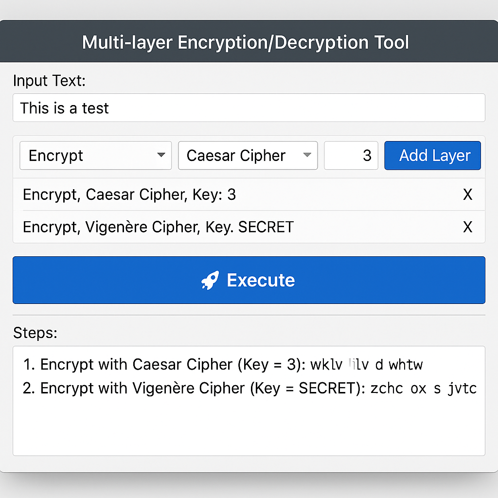

# 🔐 Multi-Encryption GUI Suite

[](https://www.python.org/)
[](https://ttkbootstrap.readthedocs.io/)


## 🚀 Overview

This project is a **powerful GUI suite** for encryption and decryption, built entirely with Python and the beautiful [`ttkbootstrap`](https://ttkbootstrap.readthedocs.io/) library for modern UI themes.

It consists of **multiple encryption algorithms**, organized into different tools and accessible from a main menu.

---

## 🧠 Features

- ✅ Easy-to-use GUI with themed interface
- 🔁 Multi-layer encryption and decryption
- 📚 Educational implementation of classic ciphers
- ⚙️ Custom key support with validation
- 🔍 Step-by-step output and result tracing

---

## 📁 Project Structure

```
.
├── main.py            # Main menu GUI to access tools
├── final_project.py   # Multi-layer encryption/decryption tool
└── SDES.py            # Simplified DES encryption tool
```

---

## 🛠️ Included Algorithms

### In `final_project.py`:
- Caesar Cipher
- Vigenère Cipher
- Playfair Cipher
- Monoalphabetic Cipher (auto key)
- Columnar Transposition (Row-Column)
- Rail Fence Cipher (Zigzag)

### In `SDES.py`:
- Mini DES (Simplified DES)
  - Includes key scheduling, S-box operations, permutations
  - Full round-by-round logging

---

## 🚀 more about project

- Multiple classical algorithms:
  - Caesar Cipher
  - Playfair Cipher
  - Vigenère Cipher
  - Columnar Transposition (Row-Column)
  - Monoalphabetic Cipher
  - Rail Fence Cipher (Zigzag)

- Multi-layer encryption/decryption.
- Material-style modern GUI with `ttkbootstrap`.
- Step-by-step result explanation.
- Supports English input only for cleaner processing.

---

## 🖼️ Interface Preview




---
### 🧭 Main Menu (`main.py`)
Allows the user to launch the SDES tool or the final encryption tool.

### 🔒 Final Encryption Tool (`final_project.py`)
- Add multiple layers of encryption.
- Select algorithm and key per layer.
- Execute and see detailed output per step.

### 🧬 SDES Tool (`SDES.py`)
- Binary/hex/text key input
- Full encryption/decryption based on Mini DES logic
- Output includes intermediate rounds and swaps

---

## ▶️ How to Run

Make sure you have Python 3 installed and the `ttkbootstrap` package:

```bash
pip install ttkbootstrap
```

Then simply run:

```bash
python main.py
```

## 🧠 How to Use

1. Enter the input text.
2. Choose the operation (`Encrypt` or `Decrypt`).
3. Select an algorithm and provide a valid key.
4. Click `➕ Add Layer` to queue the operation.
5. Add more layers as needed.
6. Click `🚀 Execute` to process all layers.
7. Output with detailed steps will appear below.

---

## 🔑 Key Rules

| Algorithm         | Key Type     |
|------------------|--------------|
| Caesar           | Numeric      |
| Zigzag (Railfence)| Numeric      |
| Row Column       | Sequence of digits (e.g., `312`) |
| Playfair         | Alphabetic   |
| Vigenère         | Alphabetic   |
| Monoalphabetic   | No key (auto-generated) |

---

## 🛠️ Requirements

- Python 3.7+
- [`ttkbootstrap`](https://ttkbootstrap.readthedocs.io/)

Install it via:

```bash
pip install ttkbootstrap

```

---


## 🎓 Educational Purpose

This project was built for learning and demonstration purposes. It's perfect for understanding how classical ciphers and simplified DES work under the hood — all wrapped in a clean, interactive GUI.

---

## 👨‍💻 Author

Built with love for cryptography and Python GUI design.  
Final project submission — educational use only.

---

## 📬 Contact

**👤 Name:** Abdelrhman Islam  

**📧 Email:** abdelrhman.islam04@gmail.com 

**🔗 [LinkedIn](https://www.linkedin.com/in/abdelrhman-islam)
**🐙 [GitHub](https://github.com/AbdelrhmanIslam)

Feel free to connect and check out my other projects and my aacounts❤😘!

---

> ✨ *"ABDELRHMAN  – ISLAM"* ✨
